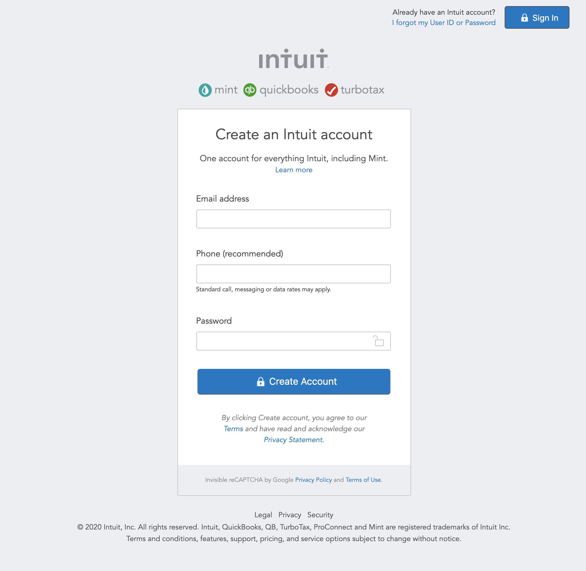

# Mint.com sign-up page clone

> This project consists of building an HTML document that matches the appearance of mint.com’s signup page

In this project, we rebuilded the form used by Mint.com for signing up new users. They have been highly praised for the design and simplicity of their site, and their signup process is very clean.

## Built With

- HMTL5
- CSS

## Live demo

<a href="https://quizzical-gates-ccc83e.netlify.com" target="_blank">Check it out</a>💻

## Getting Started

Just open/double click index.html

## Authors

👤 **Bertil Tandayamo**

- Github: [@bertil291utn](https://github.com/bertil291utn)
- Twitter: [@btandayamo](https://twitter.com/batandayamo)
- Linkedin: [Bertil Tandayamo](http://bit.ly/bertil_linkedin)

👤 **Azamat Nuriddinov**

- Github: [@bettercallazamat](https://github.com/bettercallazamat)
- Twitter: [@azamat_nuriddin](https://twitter.com/azamat_nuriddin)
- Linkedin: [Azamat Nuriddinov](https://www.linkedin.com/in/azamat-nuriddinov-57579868)

